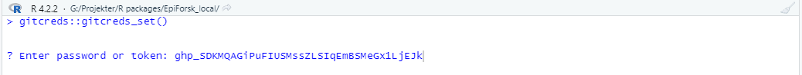

```{r, include = FALSE}
knitr::opts_chunk$set(
  collapse = TRUE,
  comment = "#>"
)
```

This vignette describes our recommended workflow for contributing your work to
the EpiForsk package, using the [usethis](https://usethis.r-lib.org/index.html)
package.

## Overview
There are a few steps you must complete the first time you want to contribute,
or when you change computer:

a. Install git. You can get it from the software center.
b. Install the devtools package in R. 
c. Generate a personal access token (PAT) to allow R access to the GitHub API.
d. fork-and-clone the EpiForsk repository to your work computer.

The next steps describe the workflow from starting work on a new contribution
to merging into the source repository:

1. Create a new feature branch for developing your functions, vignettes, and
other contributions.
2. Commit your work to your local feature branch with a description of its
contents.
3. When your contribution is ready, initiate a pull request to the upstream git
repository.
4. A package maintainer will look at your pull request, and may request changes.
Resolve these issues and push your updates.
5. When all issues are resolved, your work will be merged to the main branch.
You can now switch back to the default branch, pull upstream changes, and delete
the feature branch.

## Managing Git Credentials
To get your git credentials set up, follow these steps:

1. Log into github. 
2. Run `usethis::create_github_token()`. Alternatively, go
to [github](https://github.com/settings/tokens) and click on 
"generate new token".
 

3. Fill out the form. When using `usethis::create_github_token()`, the scope has
been pre-selected. 
 

4. Copy the generated token and store it somewhere safe.
 

5. Run `gitcreds::gitcreds_set()` to register the token in the local Git
credential store.
 
 
6. Remember to regenerate and restore your PAT on the schedule set in step 3.
The default period recommended by github is 1 month.

For more details, you can read the usethis vignette [git-credentials](https://usethis.r-lib.org/articles/git-credentials.html).

## Clone the EpiForsk repository
To protect the source repository, you must copy it to your own github account, 
and then clone it to get a local copy. This is accomplished with
```{r, eval=FALSE}
usethis::create_from_github("https://github.com/Laksafoss/EpiForsk", fork = TRUE)
```

## Contribution workflow
When working on a contribution, do so on a separate feature branch. It is best
practice to never make commits to the default branch of a fork. To create your 
feature branch, run
```{r, eval=FALSE}
usethis::pr_init("branch_name")
```

When you're done working on your contribution, commit it to your local clone. 
This can be done using the git tab in R-studio. Remember to stage any file you 
want to include in your commit and write a descriptive commit message. It is ok
to make multiple commits before initiating a 
[pull request](https://usethis.r-lib.org/articles/pr-functions.html). 
To do this, run
```{r, eval=FALSE}
usethis::pr_push()
```
This will open a webpage letting you initiate the PR. take note of the PR 
number, as this is used to reference the PR.

At this point, a package maintainer will look at your PR, and they will either
accept it or request changes. If changes are requested, work on resolving the
issues. Any changes you make must be committed to your local branch, then pushed
upstream using `usethis::pr_push()`. If changes have been committed by the 
reviewer, you can pull these using `usethis::pr_pull()`. 

When all issues are resolved, the PR will be accepted and merged into the source
repository. At this point, you should run 
```{r, eval=FALSE}
usethis::pr_finish("PR number")
```
This will switch you back to the default branch, pull changes from the source
repository and delete the local feature branch.

## Additional
When preparing a contribution, you should put some thought into the format you
use. We imagine most contributions will either be in the form of a vignette or a
function.

Think of vignettes as an article, where you can write down thoughts and ideas in
a free text format, as well as writing R code. This can be useful for sharing
examples/guides on data management, analysis methods, r packages, and so on.

In contrast to vignettes, R functions have much stricter formal
[requirements](https://r-pkgs.org/code.html). Use R functions when you need to
automate a common task, such as a data management task. There are a lot of
considerations to writing a good R function, and it will generally be a bigger
commitment than writing a vignette. A function needs good documentation,
explaining what it does and how to use it. It should also have comprehensive and
descriptive error handling. The goal is not to make the sleekest, fastest and
most efficient functions, but rather implementing functionalities tailored to
our specific needs. With that said, writing functions is not a one and done
process, and we encourage you to improve functions added to the package over
time.

For a deep dive into writing packages, check out 
[Hadley's R package book](https://r-pkgs.org/).
